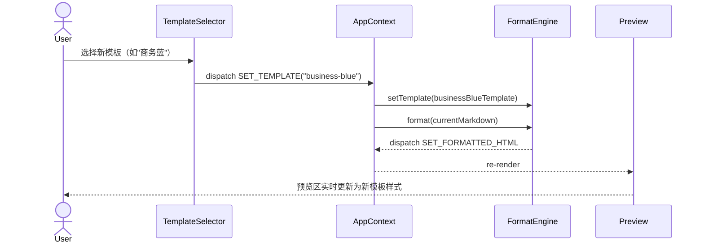
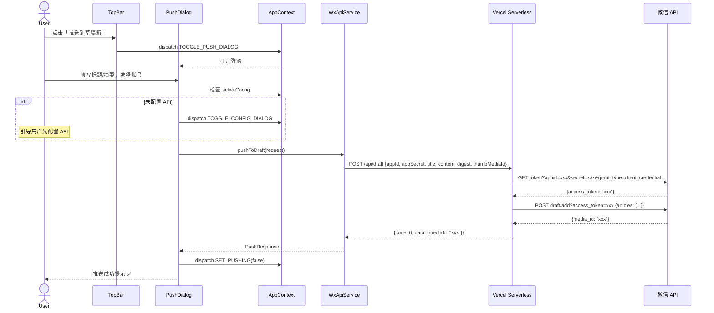
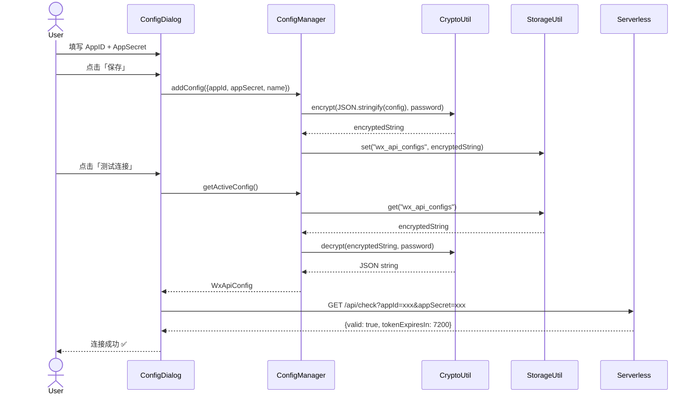
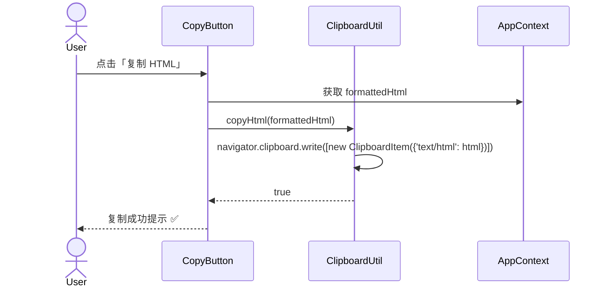
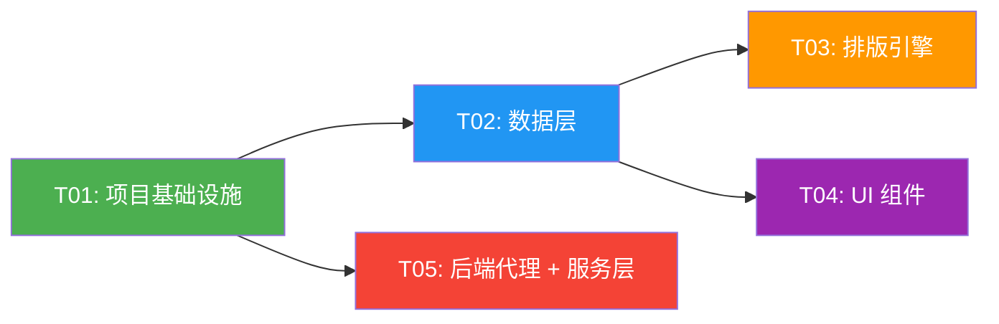

# wx-formatter 架构设计文档

> **项目**: 公众号文章一键排版工具  
> **版本**: v1.0  
> **日期**: 2025-06-05  
> **架构师**: 高见远（Gao）

---

## 目录

- [1. 实现方案与框架选型](#1-实现方案与框架选型)
- [2. 文件列表](#2-文件列表)
- [3. 数据结构与接口（类图）](#3-数据结构与接口类图)
- [4. 程序调用流程（时序图）](#4-程序调用流程时序图)
- [5. 任务列表](#5-任务列表)
- [6. 依赖包列表](#6-依赖包列表)
- [7. 共享知识（跨文件约定）](#7-共享知识跨文件约定)
- [8. 待明确事项](#8-待明确事项)

---

## 1. 实现方案与框架选型

### 1.1 整体架构

采用 **前后端分离** 架构，前端为纯 SPA 应用，后端为 Vercel Serverless Functions 充当微信 API 代理。

```
┌──────────────────────────────────────────────────────┐
│                     浏览器 (SPA)                      │
│                                                      │
│  ┌──────────┐  ┌──────────┐  ┌───────────────────┐  │
│  │ Markdown  │  │ 排版引擎  │  │  预览 / 复制 /    │  │
│  │ 编辑器    │→ │(模板+解析)│→ │  推送控制         │  │
│  └──────────┘  └──────────┘  └────────┬──────────┘  │
│                                       │              │
│                       ┌───────────────┼──────────┐   │
│                       │  localStorage │          │   │
│                       │  (加密存储)    │          │   │
│                       └───────────────┘          │   │
└───────────────────────────────────────────────────┘  │
                                    │                   │
                            HTTPS   │                   │
                                    ▼                   │
┌──────────────────────────────────────────────────────┐
│              Vercel Serverless Functions              │
│                                                      │
│  /api/auth     — 获取 access_token                   │
│  /api/draft    — 新建草稿 (draft/add)                 │
│  /api/media    — 上传图片 (media/uploadimg)           │
│  /api/check    — 测试连接（获取 access_token 验证）    │
│                                                      │
└──────────────────────────────────────────────────────┘
                        │
                        │ HTTPS (IP 白名单)
                        ▼
              ┌───────────────────┐
              │  微信公众号 API    │
              │  api.weixin.qq.com│
              └───────────────────┘
```

### 1.2 核心技术挑战与解决方案

| 挑战 | 解决方案 |
|------|----------|
| **Markdown → 内联样式 HTML** | 使用 `marked` 解析 Markdown，通过自定义 `renderer` 将模板 CSS 转换为内联 `style` 属性，确保公众号编辑器兼容 |
| **模板系统** | 定义模板数据结构（颜色、字号、间距等），渲染时通过 `template-engine` 将模板参数映射为内联样式 |
| **微信 API IP 白名单** | Vercel Serverless Functions 充当代理，Vercel 出口 IP 加入微信白名单 |
| **AppSecret 安全存储** | 使用 AES-GCM 对称加密存储在 localStorage，密钥由用户密码派生（PBKDF2） |
| **实时预览性能** | 编辑器输入做 300ms 防抖，避免每次按键触发完整重渲染 |
| **公众号 HTML 兼容性** | 排版输出仅使用内联 `style`，不依赖 `class`/`<style>` 标签，确保粘贴到公众号编辑器后样式不丢失 |

### 1.3 框架与库选型

| 类别 | 选型 | 理由 |
|------|------|------|
| **构建工具** | Vite 5 | 极速 HMR，原生 ESM，与 React + TS 深度集成 |
| **UI 框架** | React 18 | 组件化开发，生态成熟，与 MUI 深度集成 |
| **组件库** | MUI 5 | 企业级 React 组件库，Dialog/Snackbar/Select 等开箱即用 |
| **样式方案** | Tailwind CSS 3 | 原子化 CSS，快速构建编辑器布局，与 MUI 共存无冲突 |
| **Markdown 解析** | marked | 轻量、快速、可扩展 renderer |
| **代码高亮** | highlight.js | 公众号代码块语法高亮，支持常见语言 |
| **加密** | Web Crypto API（原生） | 无需第三方库，浏览器原生支持 AES-GCM + PBKDF2 |
| **剪贴板** | navigator.clipboard（原生） | 现代浏览器原生 API，无需第三方库 |
| **Serverless** | Vercel Serverless Functions | 零运维、自动扩缩、与 Vite 部署一体化 |
| **状态管理** | React Context + useReducer | 应用状态简单，无需引入 Redux/Zustand |
| **类型系统** | TypeScript | 类型安全，提升开发效率与代码质量 |

### 1.4 前后端分工

| 层次 | 职责 | 技术实现 |
|------|------|----------|
| **前端 - 编辑层** | Markdown 输入、工具栏操作、快捷键 | React 组件 + textarea |
| **前端 - 排版层** | Markdown → 内联样式 HTML 转换 | marked + 自定义 renderer |
| **前端 - 预览层** | 实时渲染、手机模拟框 | React 组件 + iframe/div |
| **前端 - 配置层** | API 配置的加密存取 | Web Crypto API + localStorage |
| **后端 - 代理层** | 获取 access_token、代理微信 API 调用 | Vercel Serverless Functions |

---

## 2. 文件列表

```
wx-formatter/
├── package.json
├── tsconfig.json
├── tsconfig.node.json
├── vite.config.ts
├── tailwind.config.ts
├── postcss.config.js
├── index.html
├── vercel.json
├── .gitignore
│
├── public/
│   └── favicon.svg
│
├── src/
│   ├── main.tsx                          # 应用入口
│   ├── App.tsx                           # 根组件（路由 + Provider）
│   ├── vite-env.d.ts                     # Vite 类型声明
│   │
│   ├── types/
│   │   ├── index.ts                      # 全局类型导出
│   │   ├── template.ts                   # 模板相关类型定义
│   │   ├── api-config.ts                 # API 配置类型定义
│   │   └── push.ts                       # 推送相关类型定义
│   │
│   ├── templates/
│   │   ├── index.ts                      # 模板注册与导出
│   │   ├── types.ts                      # 模板数据结构类型
│   │   ├── simple-white.ts               # 简约白模板
│   │   ├── business-blue.ts              # 商务蓝模板
│   │   ├── warm-orange.ts                # 暖橙模板
│   │   ├── elegant-green.ts              # 雅致绿模板
│   │   └── tech-dark.ts                  # 科技黑模板
│   │
│   ├── engine/
│   │   ├── index.ts                      # 排版引擎入口
│   │   ├── renderer.ts                   # marked 自定义 renderer
│   │   ├── style-mapper.ts               # 模板参数 → 内联样式映射
│   │   └── sanitizer.ts                  # HTML 清洗（移除危险标签）
│   │
│   ├── store/
│   │   ├── AppContext.tsx                 # 全局 Context 定义
│   │   ├── appReducer.ts                 # 全局 Reducer
│   │   └── actions.ts                    # Action 类型与创建函数
│   │
│   ├── utils/
│   │   ├── crypto.ts                     # AES-GCM 加密/解密
│   │   ├── storage.ts                    # localStorage 封装
│   │   └── clipboard.ts                 # 剪贴板复制封装
│   │
│   ├── services/
│   │   ├── api.ts                        # 微信 API 调用封装
│   │   └── config-manager.ts             # API 配置管理（CRUD + 加密存储）
│   │
│   ├── components/
│   │   ├── Layout.tsx                    # 整体布局（顶栏 + 左右分栏 + 底栏）
│   │   ├── TopBar.tsx                    # 顶部导航栏
│   │   ├── Editor.tsx                    # Markdown 编辑器（含工具栏）
│   │   ├── EditorToolbar.tsx             # 编辑器工具栏
│   │   ├── Preview.tsx                   # 手机模拟预览区
│   │   ├── TemplateSelector.tsx          # 模板选择器
│   │   ├── PushDialog.tsx                # 推送到草稿箱弹窗
│   │   ├── ConfigDialog.tsx              # API 配置弹窗
│   │   ├── StatusBar.tsx                 # 底部状态栏
│   │   └── CopyButton.tsx               # 一键复制按钮
│   │
│   └── styles/
│       ├── globals.css                   # 全局样式 + Tailwind 指令
│       └── preview.css                  # 预览区基础样式
│
└── api/
    ├── _lib/
    │   ├── wechat.ts                     # 微信 API 调用工具（获取 token 等）
    │   └── types.ts                      # API 共享类型
    ├── auth.ts                           # GET /api/auth — 获取 access_token
    ├── draft.ts                          # POST /api/draft — 新建草稿
    ├── media.ts                          # POST /api/media — 上传图片
    └── check.ts                          # GET /api/check — 测试连接
```

---

## 3. 数据结构与接口（类图）

```mermaid
classDiagram

    %% ====== 模板相关 ======
    class TemplateConfig {
        +string id
        +string name
        +string description
        +TemplateStyle style
    }

    class TemplateStyle {
        +HeadingStyle h1
        +HeadingStyle h2
        +HeadingStyle h3
        +ParagraphStyle paragraph
        +BlockquoteStyle blockquote
        +CodeBlockStyle codeBlock
        +InlineCodeStyle inlineCode
        +ListStyle list
        +DividerStyle divider
        +ImageStyle image
        +LinkStyle link
        +RootStyle root
    }

    class HeadingStyle {
        +string fontSize
        +string fontWeight
        +string color
        +string marginTop
        +string marginBottom
        +string textAlign
        +string borderBottom
    }

    class ParagraphStyle {
        +string fontSize
        +string lineHeight
        +string color
        +string letterSpacing
        +string marginTop
        +string marginBottom
        +string textAlign
    }

    class BlockquoteStyle {
        +string borderLeft
        +string paddingLeft
        +string color
        +string bgColor
        +string fontSize
    }

    class CodeBlockStyle {
        +string bgColor
        +string color
        +string fontSize
        +string borderRadius
        +string padding
    }

    class InlineCodeStyle {
        +string bgColor
        +string color
        +string padding
        +string borderRadius
        +string fontSize
    }

    class ListStyle {
        +string color
        +string fontSize
        +string lineHeight
        +string paddingLeft
    }

    class DividerStyle {
        +string border
        +string margin
    }

    class ImageStyle {
        +string maxWidth
        +string borderRadius
        +string margin
    }

    class LinkStyle {
        +string color
        +string textDecoration
    }

    class RootStyle {
        +string bgColor
        +string padding
        +string fontFamily
    }

    TemplateConfig --> TemplateStyle : style
    TemplateStyle --> HeadingStyle : h1, h2, h3
    TemplateStyle --> ParagraphStyle : paragraph
    TemplateStyle --> BlockquoteStyle : blockquote
    TemplateStyle --> CodeBlockStyle : codeBlock
    TemplateStyle --> InlineCodeStyle : inlineCode
    TemplateStyle --> ListStyle : list
    TemplateStyle --> DividerStyle : divider
    TemplateStyle --> ImageStyle : image
    TemplateStyle --> LinkStyle : link
    TemplateStyle --> RootStyle : root

    %% ====== API 配置 ======
    class WxApiConfig {
        +string id
        +string name
        +string appId
        +string appSecret
        +number createdAt
        +number updatedAt
    }

    class ConfigManager {
        -WxApiConfig[] configs
        -string activeConfigId
        +loadConfigs() WxApiConfig[]
        +saveConfigs(configs: WxApiConfig[]) void
        +getActiveConfig() WxApiConfig | null
        +setActiveConfig(id: string) void
        +addConfig(config: WxApiConfig) void
        +removeConfig(id: string) void
        +updateConfig(id: string, data: Partial~WxApiConfig~) void
    }

    ConfigManager --> WxApiConfig : manages

    %% ====== 排版引擎 ======
    class FormatEngine {
        -TemplateConfig currentTemplate
        +setTemplate(template: TemplateConfig) void
        +format(markdown: string) string
        +getHtml() string
    }

    class StyleMapper {
        +mapToInline(style: TemplateStyle, token: Token) string
        +headingStyle(style: HeadingStyle, level: number) string
        +paragraphStyle(style: ParagraphStyle) string
        +blockquoteStyle(style: BlockquoteStyle) string
        +codeBlockStyle(style: CodeBlockStyle) string
        +inlineCodeStyle(style: InlineCodeStyle) string
        +listStyle(style: ListStyle) string
        +dividerStyle(style: DividerStyle) string
        +imageStyle(style: ImageStyle) string
        +linkStyle(style: LinkStyle) string
    }

    class CustomRenderer {
        -StyleMapper styleMapper
        +heading(text: string, level: number) string
        +paragraph(text: string) string
        +blockquote(quote: string) string
        +code(code: string, lang: string) string
        +codespan(text: string) string
        +list(body: string, ordered: boolean) string
        +hr() string
        +image(href: string, title: string, text: string) string
        +link(href: string, title: string, text: string) string
        +strong(text: string) string
        +em(text: string) string
    }

    FormatEngine --> TemplateConfig : uses
    FormatEngine --> CustomRenderer : uses
    CustomRenderer --> StyleMapper : uses
    StyleMapper --> TemplateStyle : reads

    %% ====== 全局状态 ======
    class AppState {
        +string markdown
        +string formattedHtml
        +string selectedTemplateId
        +WxApiConfig[] apiConfigs
        +string activeConfigId
        +boolean isPushing
        +string errorMessage
        +boolean isConfigDialogOpen
        +boolean isPushDialogOpen
    }

    class AppAction {
        <<union>>
        +SET_MARKDOWN
        +SET_TEMPLATE
        +SET_FORMATTED_HTML
        +SET_API_CONFIGS
        +SET_ACTIVE_CONFIG
        +SET_PUSHING
        +SET_ERROR
        +TOGGLE_CONFIG_DIALOG
        +TOGGLE_PUSH_DIALOG
    }

    AppState --> WxApiConfig : apiConfigs

    %% ====== 推送请求 ======
    class PushRequest {
        +string title
        +string content
        +string digest
        +string thumbMediaId
        +string appId
        +string appSecret
    }

    class PushResponse {
        +number code
        +string message
        +string mediaId
    }

    PushResponse --> PushRequest : responds to

    %% ====== 服务层 ======
    class WxApiService {
        +pushToDraft(req: PushRequest) Promise~PushResponse~
        +testConnection(appId: string, appSecret: string) Promise~boolean~
        +uploadImage(appId: string, appSecret: string, file: File) Promise~string~
    }

    WxApiService --> PushRequest : uses
    WxApiService --> PushResponse : returns

    %% ====== 加密工具 ======
    class CryptoUtil {
        +encrypt(plainText: string, password: string) Promise~string~
        +decrypt(cipherText: string, password: string) Promise~string~
    }

    class StorageUtil {
        +get(key: string) string | null
        +set(key: string, value: string) void
        +remove(key: string) void
    }

    class ClipboardUtil {
        +copyHtml(html: string) Promise~boolean~
        +copyText(text: string) Promise~boolean~
    }
```



---

## 4. 程序调用流程（时序图）

### 4.1 核心排版流程

```mermaid
sequenceDiagram
    actor User
    participant Editor as Editor 组件
    participant Store as AppContext
    participant Engine as FormatEngine
    participant Renderer as CustomRenderer
    participant Mapper as StyleMapper
    participant Preview as Preview 组件

    User->>Editor: 输入 Markdown 文本
    Editor->>Store: dispatch SET_MARKDOWN
    Note over Editor,Store: 300ms 防抖

    Store->>Engine: format(markdown)
    Engine->>Renderer: marked.parse(markdown, {renderer})
    
    Renderer->>Mapper: headingStyle(style, level)
    Mapper-->>Renderer: "font-size:24px;color:#333;..."
    
    Renderer->>Mapper: paragraphStyle(style)
    Mapper-->>Renderer: "font-size:16px;line-height:1.75;..."
    
    Renderer->>Mapper: blockquoteStyle(style)
    Mapper-->>Renderer: "border-left:4px solid #ddd;..."
    
    Note over Renderer: 对每个 token 类型调用<br/>对应的 styleMapper 方法<br/>生成内联样式 HTML

    Renderer-->>Engine: formattedHtml (内联样式)
    Engine-->>Store: dispatch SET_FORMATTED_HTML
    Store-->>Preview: re-render with formattedHtml
    Preview-->>User: 显示排版效果
```

### 4.2 模板切换流程



### 4.3 推送到草稿箱流程



### 4.4 API 配置管理流程



### 4.5 一键复制 HTML 流程



---

## 5. 任务列表

> **规则**：最多 5 个任务，按功能模块分组，T01 为项目基础设施。

| 任务编号 | 任务名称 | 依赖 | 涉及文件 | 优先级 | 复杂度 |
|----------|----------|------|----------|--------|--------|
| **T01** | **项目基础设施** | 无 | `package.json`, `tsconfig.json`, `tsconfig.node.json`, `vite.config.ts`, `tailwind.config.ts`, `postcss.config.js`, `index.html`, `vercel.json`, `.gitignore`, `public/favicon.svg`, `src/main.tsx`, `src/App.tsx`, `src/vite-env.d.ts`, `src/styles/globals.css`, `src/styles/preview.css` | P0 | M |
| **T02** | **数据层（类型 + 模板 + 状态 + 工具）** | T01 | `src/types/index.ts`, `src/types/template.ts`, `src/types/api-config.ts`, `src/types/push.ts`, `src/templates/index.ts`, `src/templates/types.ts`, `src/templates/simple-white.ts`, `src/templates/business-blue.ts`, `src/templates/warm-orange.ts`, `src/templates/elegant-green.ts`, `src/templates/tech-dark.ts`, `src/store/AppContext.tsx`, `src/store/appReducer.ts`, `src/store/actions.ts`, `src/utils/crypto.ts`, `src/utils/storage.ts`, `src/utils/clipboard.ts` | P0 | L |
| **T03** | **排版引擎** | T02 | `src/engine/index.ts`, `src/engine/renderer.ts`, `src/engine/style-mapper.ts`, `src/engine/sanitizer.ts` | P0 | L |
| **T04** | **UI 组件** | T02 | `src/components/Layout.tsx`, `src/components/TopBar.tsx`, `src/components/Editor.tsx`, `src/components/EditorToolbar.tsx`, `src/components/Preview.tsx`, `src/components/TemplateSelector.tsx`, `src/components/PushDialog.tsx`, `src/components/ConfigDialog.tsx`, `src/components/StatusBar.tsx`, `src/components/CopyButton.tsx` | P0 | L |
| **T05** | **后端代理 + 服务层 + 集成** | T01 | `api/_lib/wechat.ts`, `api/_lib/types.ts`, `api/auth.ts`, `api/draft.ts`, `api/media.ts`, `api/check.ts`, `src/services/api.ts`, `src/services/config-manager.ts` | P0 | M |

### 任务依赖图



### 各任务详细说明

#### T01: 项目基础设施

**目标**：搭建项目骨架，确保 `npm run dev` 可启动空白页面。

**具体内容**：
- 初始化 Vite + React + TypeScript 项目
- 配置 Tailwind CSS 与 MUI 共存
- 配置 PostCSS
- 创建 `vercel.json` 指定 Serverless Functions 路由
- 创建 `index.html` 入口
- 编写 `src/main.tsx`（挂载根组件）和 `src/App.tsx`（空白布局）
- 编写全局样式 `globals.css`（Tailwind 指令 + CSS 变量）
- 编写预览区样式 `preview.css`

**验收标准**：`npm run dev` 启动后可看到空白页面，无控制台报错。

---

#### T02: 数据层（类型 + 模板 + 状态 + 工具）

**目标**：定义所有类型、5 套预设模板、全局状态管理、工具函数。

**具体内容**：
- **类型定义**：`TemplateConfig`、`TemplateStyle` 及其子类型、`WxApiConfig`、`PushRequest`/`PushResponse` 等
- **5 套预设模板**：简约白、商务蓝、暖橙、雅致绿、科技黑——每套模板导出一个完整的 `TemplateConfig` 对象
- **全局状态**：基于 `React Context + useReducer` 的 `AppContext`，包含 `AppState` 和 `AppAction`
- **工具函数**：
  - `CryptoUtil`：AES-GCM 加密/解密（使用 Web Crypto API）
  - `StorageUtil`：localStorage 读写封装
  - `ClipboardUtil`：剪贴板复制 HTML/纯文本封装

**验收标准**：所有类型无 TypeScript 报错，5 套模板可正确导入，`AppContext.Provider` 可包裹子组件。

---

#### T03: 排版引擎

**目标**：实现 Markdown → 内联样式 HTML 的完整转换。

**具体内容**：
- **FormatEngine**：核心排版引擎类，接收 Markdown 文本和模板配置，输出带内联样式的 HTML
- **CustomRenderer**：继承 `marked.Renderer`，重写所有 token 渲染方法（heading、paragraph、blockquote、code、list、hr、image、link、strong、em）
- **StyleMapper**：将 `TemplateStyle` 中的参数映射为 CSS 内联样式字符串
- **Sanitizer**：清洗输出的 HTML，移除 script 标签等危险内容

**验收标准**：给定 Markdown 输入和模板，输出的 HTML 全部使用内联样式，无 class 引用，粘贴到公众号编辑器后样式保持一致。

---

#### T04: UI 组件

**目标**：实现所有前端 UI 组件和交互。

**具体内容**：
- **Layout**：整体布局（顶栏 + 左右分栏 + 底栏），使用 MUI Grid/Flex + Tailwind
- **TopBar**：Logo、模板选择器、推送按钮、API 配置按钮
- **Editor**：Markdown 编辑区（textarea），300ms 防抖，触发排版
- **EditorToolbar**：加粗、标题、列表、引用、分割线等快捷操作
- **Preview**：375px 宽度手机模拟预览框，渲染 `formattedHtml`
- **TemplateSelector**：MUI Select 下拉选择器
- **PushDialog**：推送弹窗（标题/摘要/封面/账号选择/确认按钮）
- **ConfigDialog**：API 配置弹窗（AppID/AppSecret/测试连接/保存）
- **StatusBar**：字数统计、保存状态、错误提示
- **CopyButton**：一键复制 HTML 按钮

**验收标准**：完整的编辑-预览-复制-推送交互流程可走通。

---

#### T05: 后端代理 + 服务层 + 集成

**目标**：实现 Vercel Serverless Functions 和前端服务层，打通推送链路。

**具体内容**：
- **api/_lib/wechat.ts**：微信 API 工具函数（获取 access_token、调用 draft/add 等）
- **api/auth.ts**：`GET /api/auth` — 获取 access_token
- **api/draft.ts**：`POST /api/draft` — 新建草稿
- **api/media.ts**：`POST /api/media` — 上传图片到素材库
- **api/check.ts**：`GET /api/check` — 测试连接有效性
- **src/services/api.ts**：前端调用 Serverless 的封装（使用 fetch）
- **src/services/config-manager.ts**：API 配置管理（CRUD + 加密存储到 localStorage）

**验收标准**：配置正确的 AppID/AppSecret 后，可成功获取 access_token 并推送文章到草稿箱。

---

## 6. 依赖包列表

| 包名 | 版本 | 用途 |
|------|------|------|
| `react` | ^18.2.0 | UI 框架 |
| `react-dom` | ^18.2.0 | React DOM 渲染 |
| `@mui/material` | ^5.15.0 | 企业级 UI 组件库（Dialog, Select, Snackbar 等） |
| `@mui/icons-material` | ^5.15.0 | MUI 图标库 |
| `@emotion/react` | ^11.11.0 | MUI 依赖的 CSS-in-JS 引擎 |
| `@emotion/styled` | ^11.11.0 | MUI 依赖的 styled 组件 |
| `marked` | ^12.0.0 | Markdown 解析，支持自定义 renderer |
| `highlight.js` | ^11.9.0 | 代码块语法高亮 |
| `dompurify` | ^3.0.0 | HTML 清洗，防止 XSS |

**开发依赖**：

| 包名 | 版本 | 用途 |
|------|------|------|
| `typescript` | ^5.3.0 | 类型系统 |
| `vite` | ^5.1.0 | 构建工具 |
| `@vitejs/plugin-react` | ^4.2.0 | Vite React 插件 |
| `tailwindcss` | ^3.4.0 | 原子化 CSS 框架 |
| `postcss` | ^8.4.0 | CSS 处理工具链 |
| `autoprefixer` | ^10.4.0 | 自动添加浏览器前缀 |
| `@types/react` | ^18.2.0 | React 类型定义 |
| `@types/react-dom` | ^18.2.0 | React DOM 类型定义 |
| `@types/dompurify` | ^3.0.0 | DOMPurify 类型定义 |

---

## 7. 共享知识（跨文件约定）

### 7.1 代码规范

| 约定 | 说明 |
|------|------|
| **语言** | TypeScript strict 模式，所有文件使用 `.ts`/`.tsx` |
| **组件风格** | 函数式组件 + Hooks，禁止 class 组件 |
| **样式优先级** | 布局用 Tailwind class，组件内部样式用 MUI sx prop，预览区用内联样式 |
| **命名规范** | 组件 PascalCase，函数/变量 camelCase，常量 UPPER_SNAKE_CASE，类型 PascalCase |
| **文件命名** | 组件文件 PascalCase.tsx，工具/服务文件 kebab-case.ts |
| **导出风格** | 优先使用 named export，仅入口文件使用 default export |
| **禁止** | 禁止使用 `any` 类型，禁止 `@ts-ignore` |

### 7.2 API 约定

| 约定 | 说明 |
|------|------|
| **后端响应格式** | `{ code: number, data: T, message: string }` |
| **成功码** | `code: 0` 表示成功 |
| **错误码** | `code: -1` 表示业务错误，`code: 401` 表示 token 过期，`code: 500` 表示服务端错误 |
| **请求格式** | POST 请求使用 JSON body，`Content-Type: application/json` |
| **鉴权方式** | 每次 API 请求携带 `appId` + `appSecret`，由 Serverless 端获取 token |

### 7.3 数据存储约定

| 约定 | 说明 |
|------|------|
| **localStorage key** | `wx_formatter_configs`（API 配置）、`wx_formatter_active_config`（当前激活配置 ID） |
| **加密方式** | AES-256-GCM，密钥由用户设置密码经 PBKDF2 派生 |
| **加密格式** | `iv:ciphertext:tag`，Base64 编码拼接 |
| **默认密码** | MVP 阶段使用固定盐值派生密钥（用户无需输入密码），后续版本支持用户自定义密码 |

### 7.4 排版引擎约定

| 约定 | 说明 |
|------|------|
| **样式输出** | 所有排版结果必须使用内联 `style` 属性，不使用 `class` 或 `<style>` 标签 |
| **HTML 清洗** | 排版输出经 DOMPurify 过滤，移除 script/iframe 等危险标签 |
| **防抖间隔** | 编辑器输入 300ms 防抖后触发排版 |
| **图片处理** | Markdown 图片保留原始 URL，不自动上传（P2 需求） |

### 7.5 组件通信约定

| 约定 | 说明 |
|------|------|
| **状态管理** | 全局状态通过 `AppContext` + `useReducer` 管理 |
| **组件传参** | 展示组件通过 props 接收数据和回调，不直接访问 Context |
| **弹窗状态** | Dialog 开关状态由全局 `isConfigDialogOpen`/`isPushDialogOpen` 控制 |

---

## 8. 待明确事项

| # | 事项 | 影响范围 | 当前假设 |
|---|------|----------|----------|
| 1 | **5 套模板的具体视觉风格参数**（颜色值、字号、间距等） | T02 模板定义 | 先定义合理的默认值，后续可由设计师调整 |
| 2 | **Vercel 部署后的出口 IP**，需添加到微信后台白名单 | T05 后端代理 | 用户需自行在微信后台配置 IP 白名单 |
| 3 | **加密存储的密钥管理策略** | T02 CryptoUtil | MVP 使用固定盐值，后续支持用户自定义密码 |
| 4 | **微信公众号 access_token 缓存策略** | T05 Serverless | Serverless 函数内缓存 token（有效期 7200s），使用 Vercel KV 或内存缓存 |
| 5 | **封面图上传的来源**（本地文件 / URL） | T05 media API | MVP 支持本地上传，通过 `media/uploadimg` 接口 |
| 6 | **编辑器是否需要代码补全/语法高亮** | T04 Editor | MVP 使用纯 textarea，后续可升级为 CodeMirror |
| 7 | **P1 需求（多账号、模板自定义、历史记录等）的优先级排序** | 后续迭代 | 本次架构设计已预留扩展点，P1 留待 MVP 后实现 |
